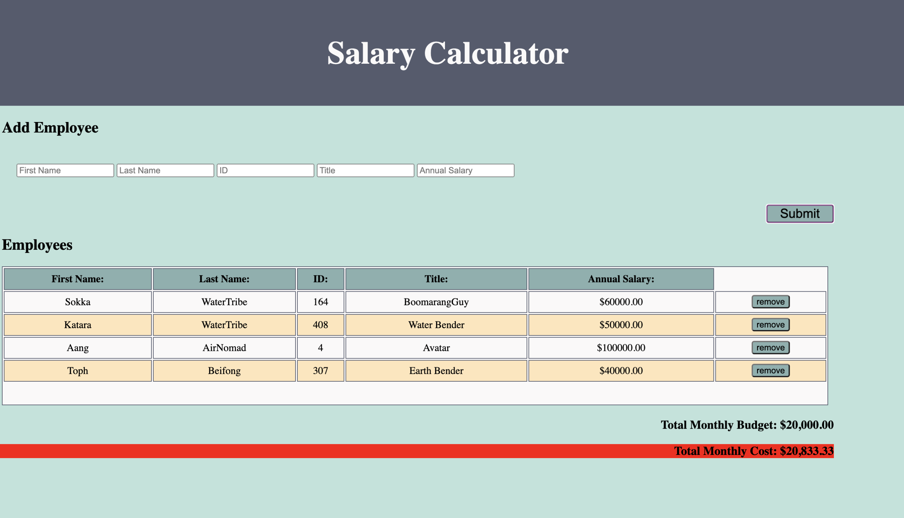

[MIT LICENSE](https://img.shields.io/github/license/scottbromander/the_marketplace.svg?style=flat-square)

# PROJECT NAME

JQuery Salary Calculator

## Description

_Duration: Weekend Project_

A salary calculator that allows the user to input an Employee with a first name, last name, unique ID, job title, and annual salary.  This employee information will be displayed, and the monthly cost of all employees will be displayed below the employee table. If the monthly cost exceeds the monthly budget, the text will acquire a red background. An employee may be removed with a button and the monthly cost will be adjusted to account for this.

## Screen Shot

## Usage
How does someone use this application? Tell a user story here.

1. Open the Html file
2. Enter accurate data on a new employee
3. click 'submit'
4. to remove an employee, click 'remove'

## Built With

Javasctript
JQuery

## Acknowledgement
Thanks to [Prime Digital Academy](www.primeacademy.io) who equipped and helped me to make this application a reality. Thanks to the Paxos team for all the help and encouragement!
